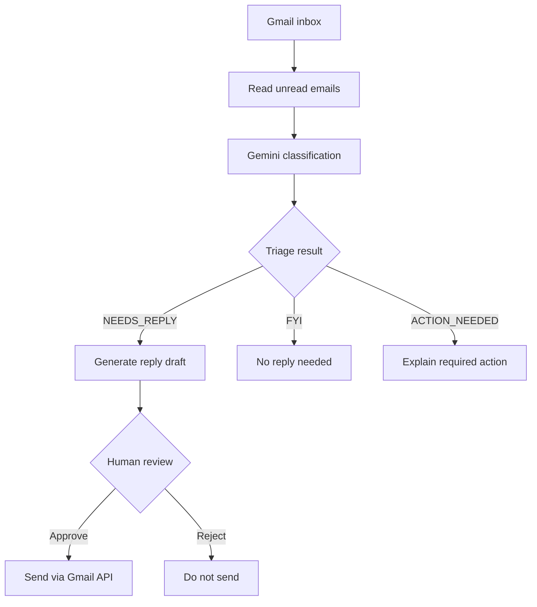

# Email AI Agent

**AI-powered Gmail triage and reply drafting with LangGraph, Google Gemini, and human-in-the-loop approval.**

[](https://www.python.org/)
[](https://github.com/langchain-ai/langgraph)
[](LICENSE)

**[Try the Streamlit demo](https://email-ai-agent-eqmi8z5twq97kwglgfdi2g.streamlit.app)** · **[View source](https://github.com/himnad/email-ai-agent)**

## Overview

Email AI Agent helps triage incoming Gmail messages and draft appropriate replies. It uses Google Gemini for classification and generation, while **keeping a human approval step before any generated reply is sent**.

The repository includes a Gmail-integrated application and a separate Streamlit demonstration. The demo is intended to showcase the workflow; **do not assume the public demo sends real emails**.

## Features

- Read unread messages using the Gmail API.
- Classify messages into `NEEDS_REPLY`, `FYI`, and `ACTION_NEEDED`.
- Generate concise, professional reply drafts with Gemini.
- Request human approval before sending generated replies.
- Send approved replies via the Gmail API; rejected drafts are not sent.
- Explain follow-up actions for action-oriented emails.
- Handle AI/API failures without treating failed operations as successful.
- Orchestrate branching decisions with LangGraph.
- Include tests using mocked external services.

## Workflow



**Safety principle:** AI generates drafts; a person decides whether to send them.

## Tech Stack

| Area | Technology |
| --- | --- |
| Language | Python |
| Workflow orchestration | LangGraph |
| LLM | Google Gemini (`langchain-google-genai` / Google Gen AI SDK) |
| Email integration | Gmail API, Google OAuth |
| Public demo | Streamlit |
| Configuration | `python-dotenv` |
| Testing | Python test modules and mocked integrations |

## Repository Structure

```text
email-agent/
├── agent/                 # LLM and agent logic
├── gmail/                 # Gmail service integration
├── graph/                 # LangGraph workflows
├── tools/                 # Email-related tools
├── ui/                    # Application UI
├── web_app/               # Web app and OAuth integration
├── demo/                  # Streamlit demo and its requirements
├── tests/                 # Tests
├── main.py                # Application entry point
├── requirements.txt       # Main app dependencies
├── README.md
└── LICENSE
```

## Getting Started

### 1. Clone the repository

```bash
git clone https://github.com/himnad/email-ai-agent.git
cd email-ai-agent
```

### 2. Create a virtual environment

**Windows CMD:**

```cmd
py -m venv venv
venv\Scripts\activate
```

### 3. Install dependencies

For the main application:

```cmd
pip install -r requirements.txt
```

For the Streamlit demo (in the same or a separate virtual environment):

```cmd
pip install -r demo\requirements.txt
```

### 4. Configure credentials for Gmail-integrated mode

The real Gmail-integrated application requires appropriate Google Cloud Gmail API/OAuth configuration and Gemini API access. Configure the credentials and environment variables expected by your local application code before running it.

**Never commit API keys, OAuth client secrets, access/refresh tokens, or private email content.** Keep secrets in local environment variables or ignored files. Google OAuth redirect URIs must match the URI configured for the application.

### 5. Run the public-style demo locally

```cmd
streamlit run demo\app.py
```

The demo and Gmail-integrated application are different execution paths. Demo behavior should not be presented as proof that real Gmail sending or OAuth is deployed publicly.

## Testing

The repository includes `tests/test_graph.py` for graph-related testing. Run it using the test runner configured in your environment; for example, if `pytest` is installed:

```cmd
python -m pytest tests\test_graph.py
```

This command has not been verified against every environment; install any missing test dependencies as needed.

## Security and Limitations

- Human approval is required before sending AI-generated drafts.
- Review generated content for accuracy and tone before approving.
- Do not expose Gmail credentials or tokens in the public repository.
- The Streamlit demo is a showcase; the real Gmail integration needs separate authorization and configuration.
- Gmail OAuth access may be restricted by Google Cloud app publishing or test-user settings.
- AI classification and drafts can be incorrect; they require user oversight.

## Roadmap

- [ ] Add architecture and UI screenshots.
- [ ] Document exact OAuth setup and entry-point commands after verification.
- [ ] Add CI checks for the existing test suite.
- [ ] Add an example environment configuration with placeholder values only.

## License

Licensed under the [MIT License](LICENSE). Third-party packages and services retain their own licenses and terms.
